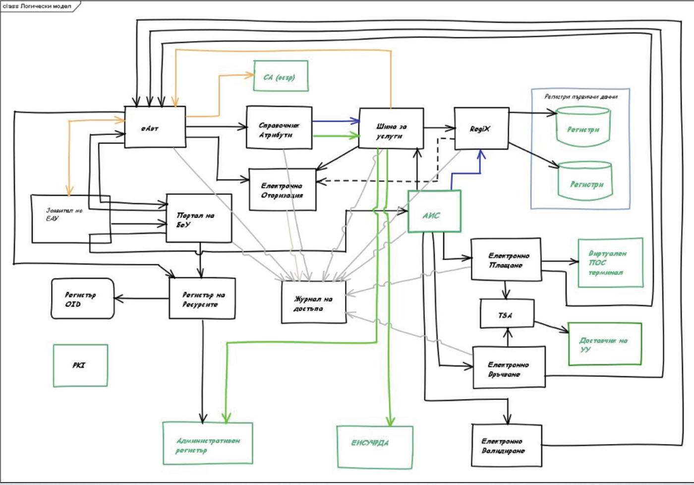
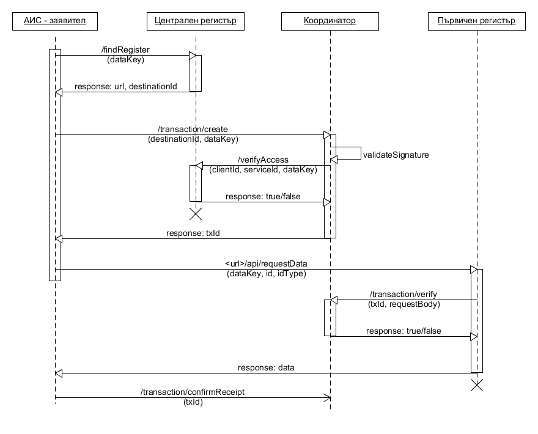

Изисквания към интеграцията на системи в рамките на електронното управление
---------------------------------------------------------------------------

1.  **Цел на документа**

    Целта на този документ е да представи конкретни технически параметри на
    системите, с цел реализиране на електронно управление. Изискванията ще
    се прилагат при разработване на нови и при надграждане на съществуващите
    системи.

    Документът, техническите детайли към него и историята на редакциите му
    могат да бъдат намерени и на адрес <http://dev.egov.bg> (все още не
    функционира). Коментари и заявки за промени на документа могат да бъдат
    изпращани на <https://github.com/governmentbg/egov-requrements/issues>.

2.  **Текущо състояние**

    В момента електронното управление де-факто не функционира заради липса
    на интеграция между системите. Това се дължи на три фактора:

    -   нормативен - нормативната уредба (Законът за електронно управление и
        наредбите към него) не позволяват свободна интеграция между системи.
        Вместо това изискват използване на де-факто “умно” ESB (ЕСОЕД -
        Единна среда за обмена на електронни документи), през което да
        минава цялата комуникация. Освен това достъпът до данните на
        първичните администратори на данни, макар отворен според ЗЕУ (Закон
        за електронното управление), е изрично затворен според специални
        закони.

    -   организационен - за да бъде пусната една система в експлоатация,
        цялата нейна изходяща и входяща комуникация трябва да бъде одобрена
        от Съвет по вписванията, и да бъде вписана в Регистрите за
        оперативна съвместимост. Освен това получаването на достъп до даден
        регистър преминава през специални споразумения и допълнителни
        стъпки. Липсва и желание от страна на някои администрации да бъдат
        интегрирани.

    -   технологичен - текущата комуникация между системи и регистри е на
        база на “електронна услуга” и “електронен документ”. Това не
        предоставя необходимата грануларност на достъп до данните, което
        създава правни пречки. Освен това ЕСОЕД и RegiX (система за
        свързване на регистри чрез уеб-услуги) не притежават някои
        необходими функционалности (напр. RegiX не поддържа асинхронни и
        subscribe заявки). Комуникацията може да минава и през “шина за
        услуги” (ESB). Първичните регистри, от своя страна, са неподготвени
        да посрещнат натоварването, което следва да понесат при реално
        функциониране на електронното управление.

    Макар на теория настоящият набор от нормативни, организационни и
    технологични решения да изглежда добър, той се оказва неприложим на
    практика.

    Следва графика на настоящата архитектура. За съжаление към момента тя не
    функционира.
    
    
    (източник: презентация на BUL-SI по проект на МТИТС)
    
    От всичко изложено дотук не следва премахването на съществуващата система, но е
    необходимо опростяване на някои нейни компоненти и взаимодействия. Много
    от описаните по-долу компоненти са вече реализирани до определено ниво,
    и могат да се преизползват или надградят. Например „журнал на достъпа“,
    „регистър на услугите“, RegiX и др.

    Описаните по-долу интерфейси са предвидени не непременно да заменят
    съществуващи решения, а да позволят лесната комуникация между системи,
    при която изпълнителите на системите да разчитат единствено на публична
    документация за да бъдат интегрирани, а не на действия и формални
    решения от административни органи.

3.  **Предложени решения**

    Нормативните проблеми са вече адресирани със закона за изменение и
    допълнение на ЗЕУ. Елиминира се нуждата от централизиран подход чрез
    ЕСОЕД (макар такъв да остава възможен), елиминират се нуждите от
    споразумения, където това е било нормативно необходимо към момента.
    Регламент 910/2014 пък разширява тълкуването на понятието
    “електронен документ”, така че да включва всички данни в електронен вид.

    Организационните и технологичните проблеми ще бъдат адресирани в този
    документ, като на повечето организационни проблеми ще бъдат предоставени
    технологични решения, елиминиращи човешкия фактор.

    Предложеното се базира на Архитектурата за електронно управление в
    [Приложение 1](https://docs.google.com/document/d/1WEbNObrBxu1SmpBcq27OzIiCuDM8vdn-xvlBk55SBJA/edit?usp=sharing)[](https://docs.google.com/document/d/1WEbNObrBxu1SmpBcq27OzIiCuDM8vdn-xvlBk55SBJA/edit?usp=sharing).

    Изискванията ще се прилагат към всички проекти за изграждане и
    надграждане на първични регистри и административни информационни
    системи, финансирани както по ОПДУ (Оперативна програма “Добро
    управление”), така и от републиканския бюджет. По този начин ще бъде
    осигурено плавното преминаване към реално функционираща система на
    електронното управление, в която всички системи, които имат нужда да
    комуникират помежду си, ще могат да го правят без организационни,
    технологични и нормативни пречки.

    Предложената архитектура и технологични решения следват принципите KISS
    и YAGNI (Keep it simple, stupid и You ain’t gonna need it). Т.е. целта е
    максимално да се опрости интеграцията и изграждането на системи.

    В допълнение, по изискванията на оперативната програма, всички системи
    ще бъдат разработвани с отворен код, като по този начин преизползването
    на често срещани функционалности ще бъде улеснено.

4.  **Интерфейси**

    Следват конкретни интерфейси и структури, които първичните регистри и
    консуматорите (АИС-и) трябва да предоставят и извикват.

    Всички примери са дадени в JSON формат, но XML със същата структура също
    следва да се поддържа.

    Разграничаването на JSON от XML следва да става с използване на `Accept`
    HTTP header: съответно `application/json` или `text/xml`.

    **За първични регистри:**

    Първичните регистри следва да предоставят следните интерфейси:

    Заб: препоръчва се адресът на API-то да бъде достъпно чрез поддомейн
    `api.<url>/.` Параметърът `{version}` показва версията, като първоначално
    тя е `1`.

    1.  `GET /api/{version}/docs` - документация на всички предоставени
        уеб-услуги (вж. секция „Документация на интерфейсите“) . Всеки
        първичен регистър трябва да има стандартните, описани по-долу
        уеб-услуги. Както те, така и всички останали уеб-услуги, трябва да
        бъдат детайлно документирани - адрес, метод, параметри, поддържани
        сериализационни формати, начин на извикване (синхронно, асинхронно,
        абонамент), очаквано време (timeout) за асинхронни заявки и т.н.

    2.  `GET /api/{version}/data` - списък с данни, които предоставят
        регистърът. Съществуват предефинирани основни типове, като “имена”
        или “адрес”. Вж. т.4. Например:

        ```
        {
          "data": [
            {
                "key": "names",
                "description": "Три имена",
                "version": 1,
                "type": "Names",
                "idTypes": [ "ЕГН", "ЛНЧ" ]
            },
            {
                "key": "current_address",
                "description": "Настоящ адрес",
                "version": 2,
                "type": "Address",
                "idTypes": [ "ЕГН", "ЛНЧ" ]
            },
            {
                "key": "current_address",
                "description": "Настоящ адрес",
                "version": 1,
                "type": "Address",
                "idTypes": [ "ЕГН", "ЛНЧ" ],
                "deprecated": true
            }
          ]
        }
        ```

    3.  `GET /api/{version}/services` - връща списък на уеб-услуги, които
        предоставя АИС-ът, с техните описания (XSD/json schema)

    4.  `GET /api/{version}/dataType/{key}` - използвайки Json-schema
        ([*http://json-schema.org/examples.html*](http://json-schema.org/examples.html))
        или XSD, дефинира типовете структурите на данните, реферирани в
        полето type на горния списък. Параметърът “key” отговаря на
        стойността в type. Тези типове се извличат автоматично от централния
        регистър и стават де-факто “регистър на информационните обекти”
        според ЗЕУ.

    5.  `GET /api/{version}/idTypes` - дава списък с поддържане типове
        идентификатор (на физически лица, юридически лица, автомобили и
        т.н.):

        ```
        {
          "idTypes" : [
            {
                "idType": "ЕГН",
                "description": "Единен граждански номер на физически лица"
            }
          ]
        }
        ```

    6.  `POST /api/{version}/requestData/<txId>` - заявка за данни.

        -   txId е идентификатор на транзакция, който следва да бъде 
            проверен в централния компонент

        -   тялото на заявката следва да съдържа следното:

    ```
    {
        "clientId" : "5c24acb8-e001-4d92-bb0c-5a02072ca1e9",
        "destinationId" : "b25b24c2-17f2-4ac3-885e-261506a8c693",
        "requestType" : "SYNCHRONOUS",
        "endpointType" : "DATA",
        "requestedDataFields" : [
            {
                "key": "names",
                "version": 1
            },
            {
                "key": "current_address",
                "version": 1
            }
        ],
        "idType" : "ЕГН",
        "id" : "8112120511",
        "requestingPerson" : "Иван Иванов",
        "requestingPersonAuthenticationToken" : "a43vsfda5342",
        "serviceId": "123445"
    }
    ```

    -   Проверката на заявка в централния компонент се извършва, като се
        изпрати заявка към него, съдържаща полученото тяло на заявката от
        заявителя към

    `POST
    https://<central-service-URL>/api/{version}/transaction/verify?txId=<txId>`

    -   При успешна верификация, централният компонент отговаря с true и
        първичният администратор на данни следва да предостави отговор на
        заявителя.

    -   Типове заявки:

        - `SYNCHRONOUS` - изисква се синхронен отговор
        - `ASYNC` - изисква се асинхронен отговор да бъде изпратен на адрес,
            посочен в полето callbackUrl.
        - `SUBSCRIBE` - всяка промяна в заявените данни следва да бъде
            изпращане на адрес, посочен в полето callbackUrl
        - `UNSUBSCRIBE` - отказ от заявен `SUBSCIRBE`

    -   Структурата на синхронния отговор, както и на асинхронните отговори,
        изпратени към callbackUrl следва да бъде:

    ```
    {
        "txId": "5c24acb8-e001-4d92-bb0c-5a02072ca1e9",
        "timestamp": "2016-01-01T17:43:19+02:00",
        "success": true,
        "data": [
            {
                "key": "names",
                "value": {
                    "firstName": "Петър",
                    "lastName": "Петров"
                }
            }
        ]
    }
    ```

    -   Известия за промяна при заявени данни с тип SUBSCRIBE следва да се
        изпращат на callbackUrl със следния формат”

    ```
    {
        "requestTxId": "5c24acb8-e001-4d92-bb0c-5a02072ca1e9",
        "timestamp": "2016-01-01T17:43:19+02:00",
        "dataChanged": "current_address"
    }
    ```

    Заявителят следва да разбере за кой идентификатор (напр. ЕГН) се отнася
    известието на база на requestTxId, което следва да пази в системата си
    при SUBSCRIBE заявки.

    **За АИС (консуматор)**

    Консуматорът поддържа само два интерфейса, на дефиниран от него адрес.

    1.  интерфейс за приемане на асинхронен отговор (в.ж. 4.1.6, типове
        заявки)

    2.  интерфейс за приемане на известия за промени на данни (в.ж. 4.1.6,
        типове заявки)

    Преди изпращане на заявка до първичен регистър, всеки консуматор
    трябва да създаде транзакция, извиквайки
    `<координатор>/transaction/create` Примерна заявка:

    ```
    {
        "clientId" : "5c24acb8-e001-4d92-bb0c-5a02072ca1e9",
        "destinationId" : "b25b24c2-17f2-4ac3-885e-261506a8c693",
        "destinationServiceId" : "b25b24c2-17f2-4ac3-885e-261506a8c693",
        "requestType" : "SYNCHRONOUS",
        "endpointType" : "DATA",
        "requestedDataFields" : [ "names", "address" ],
        "idType" : "ЕГН",
        "id" : "8112120511",
        "requestingPerson" : "Иван Иванов",
        "requestingPersonAuthenticationToken" : "a43vsfda5342",
        "serviceId": "123445"
    }
    ```

    Необходимо е и да бъдат предоставени два HTTP header-a:

    -   `Signature` - електронно подписаното тяло на заявката

    -   `Signature-Algorithm` - алгоритъмът, използван за съставянето на
        `Signature`, напр. SHA256withRSA

    Полетата за всяка заявка за данни са:

    Задължителни:

    -   `clientId` - идентификатор на администрацията-заявител (от
        административния регистър)

    -   `destinationId` - идентификатор на администрацията, предоставяща
        данните/услугата (от административния регистър)

    -   `destinationServiceId` - идентификатор на първичния регистър / АИС,
        предоставящ данните/услугата. Всеки АИС (вкл. регистър) избира
        собствен идентификатор и го публикува в централния компонент.
        АИС-заявител може или да конфигурира предварително този
        индентификатор (вземайки го от списъка на централния регистър), а
        може да го заявява периодично, питайки централния регистър “кой е
        идентификатора на регистъра, който предодставя данна X”

    -   `requestType` - тип на заявката - синхронна/асинхронна/заявка за уведомяване

    -   `endpointType` - тип на крайната точка на транзакцията - дали
        предоставя данни (`/requestData`) (`DATA`) или е пълноправна услуга
        (`SERVICE`)

    -   `requestedDataFields` - данните, които се заявяват, като `key` съдържа
        името на данната, а `version` – версията, която се заявява

    -   `idType` - типът на използвания идентификатор, поддържан от първичния
        администратор (`/api/idTypes`)

    -   `id` - идентификатора на лицето/автомобила/имота/и т.н., за които се искат данни

    -   `originatingDocumentId` - идентификатор на документ (преписка) на
        заявителя, на база на който се изисква достъпа до данните

    Опционални:

    -   `serviceId` - идентификатор на услугата (от регистъра на
        услугите), за изпълнението на която са нужни данните.

    -   `legalReason` - правно основание за заявяването на
        данните, когато те не са заявени за конкретна услуга

    -   `originatingDocumentType` - тип на документ на заявителя,
        на база на който се изисква достъпа до данните, в свободен текст,
        дефиниран от АИС-заявител.

    -   `requestingPerson` - имената на длъжностното лице, което
        инициира заявката. В случай на автоматизирана заявка не се
        попълва. Вж. т.10.

    -   `requestingPersonAuthenticationToken` -
        token/идентификатор, издаден от валидиращият орган за електронна
        идентификация (Identity Provider), по който може да бъде
        идентифицирано длъжностното лице, извършило заявката. В случай на
        автоматизирана заявка не се попълва. Вж. т.10.

    -   `callbackUrl` - адрес (URL), на който да бъде изпратен
        отговора на `ASYNC` или `SUBSCRIBE` заявка

5.  **Документация на интерфейсите**

    Всеки предоставен REST приложно-програмен интерфейс трябва да бъде
    документиран чрез API Blueprint
    (<https://github.com/apiaryio/api-blueprint>) или сходна технология.

    Аналогично представяне е нужно и за SOAP интерфейсите.

6.  **Сигнализиране за грешки**

    Всяка заявка към приложно-програмния интерфейс на системата се смята за
    успешно изпълнена, освен ако HTTP Status кодът на отговора ѝ не е код за
    грешка (4XX или 5XX).

    При възникване на грешка по време на заявка, системата трябва да върне
    подходящ HTTP Status код и в тялото на отговора трябва да присъства
    следната структурирана информация за възникналата грешка (`id` и
    `description` са задължителни):

    ```
    {
        "id": "<идентификатор на грешката – числов или символен>",
        "description ": "подробно и лесно за разбиране обяснение в какво се
    изразява грешката",
        "userMessage": "кратко обяснение на грешката, подходящо запоказване на краен потребител",
        "details ": {
            "<идентификатор на обект>": [
                "информация за грешка 1",
                "информация за грешка 2",
            ],
        ...
        }
    }
    ```

    При грешка в отговора на асинхронна заявка (ASYNC), регистърът изпраща
    следното съобщение към `callbackUrl`-а:

    ```
    {
        "txId": "5c24acb8-e001-4d92-bb0c-5a02072ca1e9",
        "success": false,
        "error": <Error Object>
    }
    ```

7.  **Сигурност**

    Следващите изисквания подлежат на промяна с цел да бъдат отразени
    последните открития в сферата на информационната сигурност.

    Имплементирането на промени в софтуерните системи в отговор на промените
    в тези изисквания, които са в резултат на откритие на проблем със
    сигурността, който може да доведе до изтичане на данни, трябва да се
    случва незабавно.

    1.  **Криптографски протоколи**

        Комуникацията между интерфейсите трябва да се извършва през HTTPS
        протокол, с използване на минимум TLS 1.2 за сигурна автентикация и
        криптиране на канала.

        Използването на доказано дефектни протоколи като SSL 1.0/2.0/3.0 е
        недопустимо.

        При изграждане на нови проекти, следва да се използват последните версии
        на протоколите и алгоритмите.

        При надграждане на съществуващите системи, където сървърите и средата не
        може да бъде приведена до последна версия, трябва да се използват
        максималните поддържани версии.

    2.  **Комплекти от шифри**

        Допустимите Cipher Suites за TLS 1.2 (ограничено подмножество, което
        вероятно ще влезе в TLS 1.3)

        **Key exchange / agreement**

        Ephemeral Diffie-Hellman (TLS\_DHE), parameters \>3072 bit (не се
        поддържат преди Java 1.7)

        Elliptic Curve Ephemeral Diffie-Hellman (TLS\_ECDHE) с елиптична крива с
        поне 256-бита големина на частния ключ, тъй като поддържат “Perfect
        Forward Secrecy”

        **Authentication**

        RSA с частен ключ с дължина поне 3072 бита(\>=3072bit), ECDSA с
        елиптична крива с частен ключ с дължина поне 256 бита.

        **Bulk ciphers**

        AES-128, AES-256 в режим GCM или Galois/Counter Mode или друг
        authenticated encryption режим,.

        **Hash-based Message Authentication Code**

        SHA-256, SHA-384, SHA-512

        **Позволени комбинации:**

        TLS\_DHE\_RSA\_AES128\_GCM\_SHA256  
        TLS\_DHE\_RSA\_AES256\_GCM\_SHA384  
        TLS\_ECDHE\_RSA\_AES128\_GCM\_SHA256  
        TLS\_ECDHE\_RSA\_AES256\_GCM\_SHA384  
        TLS\_ECDHE\_ECDSA\_AES128\_GCM\_SHA256  
        TLS\_ECDHE\_ECDSA\_AES256\_GCM\_SHA384  

    3. **Електронно подписване**

        Когато е нужно електронно подписване, се прилага хеш функция върху
        документ, който се подписва, и резултатът от хеш функцията се подава към
        сигурното устройство (HSM/смарткарта) за подписване.

        Електронното подписване става с използването на електронен печат на
        организацията. Този електронен печат следва да бъде одобрен от орган,
        който регулира издаването и използването им (CA към централния
        регистър). Електронните печати следва да могат да се използват от
        софтуера, който реализира услугите, без човешка намеса.

        Когато потребител трябва да подпише документ, браузърите не предоставят
        стандартна функционалност, което води до нуждата от специфични и
        непреносими в различни браузъри решения. Тъй като всеки притежател на
        квалифициран електронен подпис разполага с desktop софтуер за електронно
        подписване, следва да се обмисли опция за качване на вече подписани
        файлове.

    4. **Управление на пароли**

        Паролите, когато се такива се използват в АИС-а, следва да бъдат
        съхранявани в базата данни след използване на алгоритми като bcrypt,
        scrypt или PBKDF2. Следва да имат и изискване за дължина, поне 6
        символа, и препоръка за използване на изрази, вместо единични думи.


7.  **Диаграма на действията**

    

8.  **SDK**

    Всеки АИС (вкл. регистрите) трябва да предоставя SDK-и за достъп до
    уеб-услугите си на езика, на който е разработен АИС-а. При разработване
    на АИС-и-консуматори на друг програмен език, те предоставят за публично
    ползване SDK-и, които са написали.

    Базови SDK, включващи компоненти за достъп до стандартизирания процес по
    заявяване на данни (описан в т.6) ще бъдат налични от централния
    координатор, а специфичните SDK-и за всеки АИС трябва да ги надграждат.

    SDK-ите трябва да бъдат публикувани в стандартните хранилища за
    библиотеки (напр. Maven Central, NuGet, PEAR), като параметрите за
    тяхното включване в други проекти трябва да бъдат дефиниране в README
    файл в хранилището на проекта.

9.  **Електронна идентификация и журнал на действията от страна на АИС**

    Всеки АИС (вкл. първичните регистри) трябва да поддържат вход за
    длъжностни лица в администрациите с националната схема за електронна
    идентификация. Преди тя да бъде достъпна, за временен преходен период,
    това може да става и с квалифициран електронен подпис (напр. чрез
    системата за електронна автентикация).

    Всеки път, когато длъжностно лице се идентифицира електронно пред
    системата, центърът за електронна идентификация (Identity Provider)
    предоставя token за достъп до данни и token, идентифициращ уникално
    текущата сесия. Вторият token трябва да бъде включен в ръчни заявки за
    данни, за може впоследствие еднозначно (чрез корелиране на този token
    между централния координатор и валидиращия орган) да се определи дали
    заявителят наистина е този, който се твърди.

    Отделно от това, всеки АИС трябва да пази журнал на действията. В него
    трябва да се записва длъжностното лице, извършеното от него действие,
    заедно с датата и часа (използвайки системата определяне на единно
    време).

10.  **Допълнителни изисквания към първичните регистри**

    Първичните регистри трябва да:

    -   обявят своето съществуване на координатора, като при стартирането си
        извикат `POST /registers` с тяло със следната структура:

    ```
    {
        "administrationId" : "b25b24c2-17f2-4ac3-885e-261506a8c693",
        "serviceId" : "b25b24c2-17f2-4ac3-885e-261506a8c693:BRRA"
        "serviceName" : "Търговски регистър",
        "serviceRootUrl": "http://api.brra.bg"
    }
    ```

    HTTP header-ите `Signature` и `Signature-Algorithm` трябва да се използват и
    при тази заявка.

    - `administrationId` е идентификатора от ИИСДА на администрацията,
    предоставяща регистъра.

    - `serviceId` е идентификатора на АИС (регистъра, в случая), който се
    образува от идентификатора на администрацията, двоеточие, и уникален
    ключ за система в рамките на администрацията.

    -   Освен продукционната среда, всеки първичен регистър трябва да
        поддържа и поне една тестова/staging среда. Данните в тестовата
        среда не трябва да бъдат реални, а трябва да бъдат документирани в
        `/api/docs/test`

    -   Поддържат услуга за проверка на законно представителство (напр.
        Търговският регистър поддържа проверка дали дадено физическо лице е
        законен представител на юридическо лице, база данни население
        поддържа проверка дали дадено лице е законен представител на
        малолетно или непълнолетно лице)

    
11.  **Производителност**

    -   Всяка система трябва да поддържа т.нар. rate-limiting -
        механизъм, ограничаващ всеки заявител до не повече от определен
        брой заявки в секунда. Примерен отговор при достигане на лимита
        изглежда така:

    ```
    429 Too Many Requests
    Content-Type: application/json
    Rate-Limit: 200.00
    {
        "error": {
            "description":"The request rate limit of 200.0 requests/s is exceeded."
        }
    }
    ```

    -   кеш - следва да се използват различни видове кешове, с цел избягване
        на излишно четене от диск или от мрежов ресурс. Основен кандидат за
        кеширане е достъпът до базата данни. Системата за кеширане може да
        бъде локална (в текущата виртуална машина/процес) или разпределена.
        Някои разпределени системи за кеш са: Redis, Infinispan, EhCache,
        JBoss DataGrid, Memcached, AppFabric Caching, Hazelcast...
        Кои елементи/завки/извиквания да бъдат кеширани зависи от анализ на 
        тяхното използване. Кешът може да има негативен ефект, в зависимост 
        от hit-to-miss съотношението. 
        Препоръчваната политика за изтриване на елементи от кеша 
        при препълване на LRU (least recently used)
        Регистрите не трябва да предоставят остарели данни. При промяна на 
        даден запис, съответният елемент в кеша трябва да става невалиден.


    -   опашки - системите могат да обработват заявки чрез опашки, например
        за заявки, очакващи асинхронен (ASYNC) отговор. Заб: заявка за
        обиРегистрите не трябва да предоставят остарели данни. При промяна
        на даден запис, съответният елемент в кеша трябва да става
        невалиден. Обикновено четене от базата данни по принцип не би следвало да има
        нужда от опашка.

    -   времето за отговор на всяка заявка за данни към първичен
        регистър трябва да е не повече от 200 милисекунди при стандартно
        натоварване.

12.  **Отказоустойчивост**

    Всеки АИС трябва да е напълно функционален дори при нарушение на части
    от софтуерната, хардуерната и мрежовата инфраструктура:

    -   приложните сървъри трябва да бъдат в клъстер и да са поне два.
        Препоръчително е в самите сървъри да няма съдържание (т.е. да бъдат
        stateless), което да позволи хоризонтално мащабиране.

    -   трябва да се използва т.нар. load balancer за балансиране на
        натоварването към приложните сървъри.

    -   сървърите за данни трябва или да бъдат в клъстер (ако системата за
        управление на бази данни го позволява), или да поддържат т.нар.
        failover към друг сървър, към който основният се репликира.

    -   Ако даден АИС (вкл. първичен регистър) не отговори успешно, заявките
        се маркират като “незавършени” в системата на заявителя и се
        изпълняват отново след време.

13.  **Браузъри и уеб**

    Интернет-приложенията трябва да работят и изглеждат по еднакъв начин на
    последните две версии на браузъри с над 10% пазарен дял. Не се допуска
    някоя система да работи “само на Internet Explorer”, например.

    Публичният интерфейс на всяка система трябва да бъде удобен за ползване
    чрез мобилни устройства.

    Публичната част на всяка система трябва да има валиден цифров
    сертификат, издаден от разпознато в браузърите Certificate Authority.

14.  **Общи бележки**

    -   Освен гореописаните интерфейси, всеки АИС (вкл. регистър) може
        да поддържа и произволни уеб-услуги. Проверката на
        автентикацията на заявителя е отговорност на системата,
        предоставяща уеб-услугата.

    -   Всички структури на данни за комуникация между АИС, първични
        регистри и координатор могат да бъдат намерени на
        [*http://dev.egov.bg/schemas*](http://dev.egov.bg/schemas),
        както и на адрес на всеки АИС (вж секция “Документация на
        интерфейсите)[](http://dev.egov.bg/schemas)
    -   Форматът за дати и часове следва да бъде ISO 8601

    -   Частните ключове, използвани за електронно подписване и
        декирптиране, следва да бъдат съхранявани на HSM

    -   Всяка операция трябва да бъде повторена при неуспех минимум 3
        пъти, с т.нар. exponential backoff.

    -   Ако и след повторението изпращането на отговор към callbackUrl
        не е успешно, трябва да се запише като “изчакващо” в системата и
        да бъде изпратено в следващ момент.

    -   Рутерите, firewall-ите и други механизми следва да бъдат
        конфигурирани така, че да позволяват използването на
        нестандартни HTTP header-и (като Signature)

    -   Според условията за допустимост на ОПДУ и аналогично РМС, всички
        системи следва да се разработват с отворен код от ден едно в
        публично хранилище.

15.  **Описание на централния координатор**

    Централният координатор е интеграционен компонент. През него минават
    само метаданни, а не цялата комуникация. В диаграмата по-горе ясно се
    вижда неговото участие. Основните му функции са:

    -   да провери автентичността на заявката и заявителя

    -   да провери дали заявителят има достъп (базиран на право основание)
        до данните, които е заявил.

    -   да запише информация за заявката в журнал, използвайки сигурно
        време, предоставено от Time Stamping Authority (т.нар. СОЕВ), така
        че да гарантира противопоставимост в съда.

    -   да предостави механизъм на системата на първичния регистър да
        провери дали всяка, получена от него заявка, е оторизирана.

16.  **Описание на централния регистър**

    Централният регистър е логически компонент, реализиран от една страна
    чрез ИИСДА (Интегрирана Информационна Система на Държавна
    Администрация), от друга страна с отделна база данни към централния
    координатор.

    Данните в ИИСДА се попълват от администрациите и утрърждават от
    администрацията на министерския съвет, в съответствие с Наредбата за
    административния регистър.

    За всяка услуга (без значение дали към момента на въвеждане тя е
    електронизирана) се води списък с данни, до които администрацията, която
    извършва услугата, има нормативно-обоснован достъп. При попълване на
    тези данни от администрациите, те се вземат от публикуваните типове
    данни от всеки първичен регистър, чрез интерфейса /api/data, и се
    представят в удобен за търсене вид (напр. първичен регистър + описание
    на данната)

    Ако даден тип данни не е публикуван от никой регистър към момента на
    въвеждането на данни в административния регистър, то този избор може да
    бъде направен впоследствие.

    Централният регистър поддържа и PKI-инфраструктурата.

    Освен функционалностите на ИИСДА, с която основно комуникира
    координаторът, АИС-ите имат достъп до няколко списъка:

    Намиране на регистър, който предоставя дадена данна:

    ```
    GET https://<central-registry-url>/api/findRegister?dataKey={dataKey}
    ```

    Намиране на всички регистри на дадена администрация:

    ```
    GET https://<central-registry-url>/api/findRegister?destinationId={destinationId}
    ```

1.  **Често задавани въпроси**

    - Защо не се използва изцяло RegiX?
    - RegiX адаптира стари (legacy) системи. В тази си част той ще бъде
    използван. В случаите, в които първичните регистри, които RegiX
    адаптира биват надградени, става излишно и усложняващо поддържането на
    адаптер в синхрон с промените в системата и структурата на нейните
    данни. Поддържането на SUBSCRIBE функционалност чрез адаптер е трудно
    постижима.

    * * *
    
    - Защо не се използва oid регистър, а всеки АИС публикува избран от
    себе си идентификатор?
    - Ръчното поддържане на още един регистър, с процедурите по вписване
    в него, утежнява процедурата по включване. Предвид, че всеки АИС все
    пак принадлежи на някоя администрация, която е вписана в ИИСДА,
    идентификаторите в рамките на администрацията следва да се избират от
    нея и да не бъдат одобрявани от никого.*

    * * *
    
    - Защо peer-to-peer комуникация?
    - Поддържането на сложен централен интеграционен компонент има смисъл
    единствено, когато стари (legacy) системи трябва да бъдат интегрирани.
    Предвид престоящото надгражене и изграждане на първични регистри, такъв 
	интеграционен компонент не е нужен. Още повече, че той би следвало да 
	поема цялото натоварване, което го прави по-сложен за реализиране и 
	поддържане. При peer-to-peer комуникацията всяка система, която има 
	нужда от дадени данни (и има законово основание да ги чете), ще може 
	да направи това с проста уеб-услуга.

    * * *
     
    - Защо все пак е нужен централен координатор на заявки?
    - Централен координатор (който обаче не е ESB и няма за цел да
    трансформира или рутира заявки) е необходим заради проверките на
    правото на достъп и за запзване на централен журнал на достъпа (на
    база на който да се установява нерегламентиран достъп, например). Също
    така централният компонент поема и автентикацията на заявителя пред
    регистъра. Така нито заявителят, нито регистърът има нужда да
    реализират функционалност за проверка на права на достъп, за запис в
    журнал или за автентикация. Единственото, което следва да направят е
    по една заявка към централния координатор.
     
    * * *
    - Защо се използва PKI за автентикация на системи?
    - Теоретично е възможно използването на HMAC за автентикация при
    правене на заявка. Както е описано [тук](http://crypto.stackexchange.com/questions/5646/what-are-the-differences-between-a-digital-signature-a-mac-and-a-hash)),
    HMAC автентикацията не предоставя уверение за пред 3-ти лица, че
    заявката наистина е изпратена от този, който твърди, че я изпраща.
    Т.е. компрометиран централен компонент би могъл да инициира заявка от
    името на кой да е заявител. Използването на електронен подпис и PKI (в
    технологичния смисъл), решава този проблем.

    * * *
     
    - Защо отпада съгласуването на заявките, отговорите и структурите от
    данни за оперативна съвместимост
    - Съгласуването на схеми на документи е излишна бюрократична стъпка.
    Първичните администратори на данни, като отговорници за данните,
    дефинират формата, който се използва. Всички останали консуматори
    следват така дефинирания формат. Все пак, вече дефинираните и одобрени
    структури следва да се използват при надграждането на регистрите, а
    органът, отговорен за електронното управление, следва да консултира
    форматите с изпълнителите, изграждащи информационните системи на
    регистрите.

    * * *
     
    - Защо човешкият фактор се минимизира?
    - Всяко човешко действия в процеса въвежда потенциал за грешка, за
    забавяне или дори за корупция. Затова свеждането им до минимум и
    използването на системата на “автопилот” е ключово за бързото и
    качествено реализиране на електронното управление. Човешкият фактор се
    свежда до:
        -   въвеждане на данните, до които услугите имат достъп и тяхното правно основание
        -   одобряване на регистрираните администрации, след което да им бъде
       издаден цифров сертификат.
